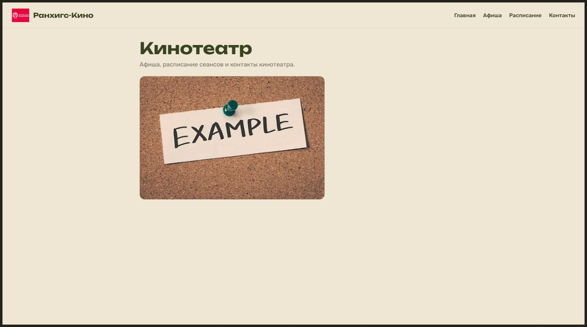
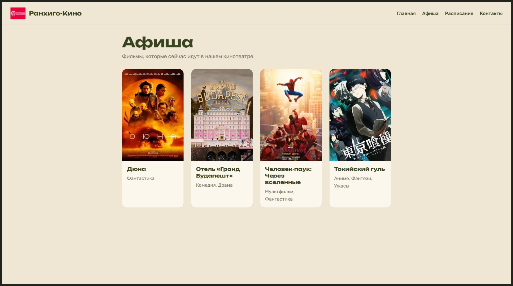
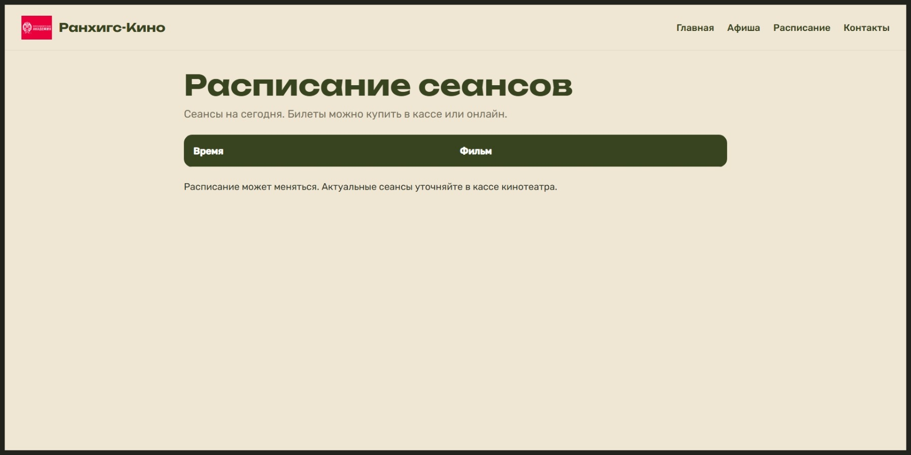
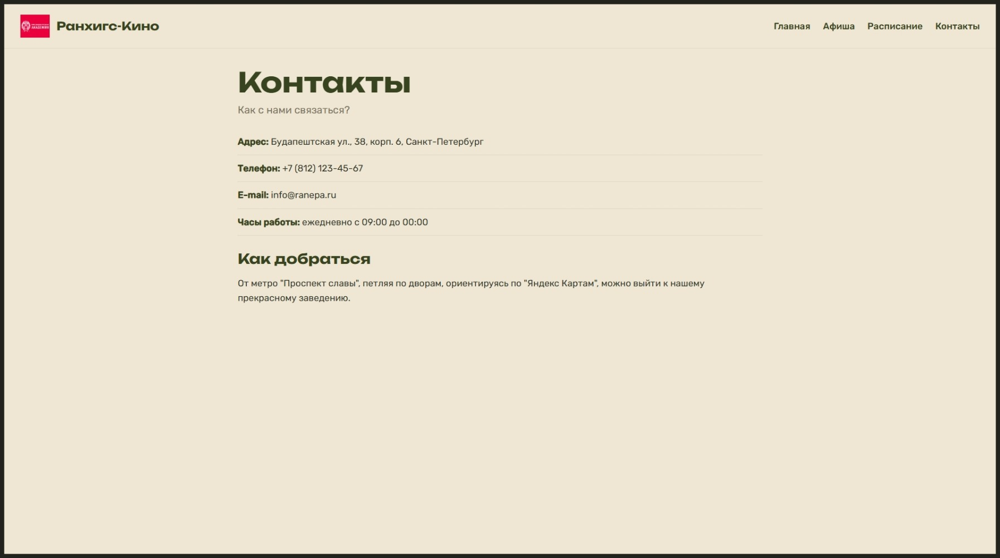

# Ранхигс-Кино

Сайт кинотеатра "Ранхигс-Кино". Включает в себя: главную страницу, афишу, страница фильма, расписание и контакты.


## Состав группы

- Портнягин Д.
- Кутузов Р.
- Загоруйко Б.

## Распределение страниц

- Кутузов Р. - Главная (`/`), Расписание (`/schedule`), Контакты (`/contacts`)
- Портнягин Д. - Афиша (`/films`), Фильм (`/films/<id>`)

## Технологии

   

## Установка и запуск
Перед production-деплоем задайте переменную окружения `SECRET_KEY`. Пример находится в `.env.example`. На Vercel добавьте её в разделе Project Settings → Environment Variables.

```bash
py -m venv .venv
.venv\Scripts\activate
pip install -r requirements.txt
py run.py
```

## Маршруты

- `/` - главная
- `/films` - афиша
- `/films/<id>` - страница фильма
- `/schedule` - расписание
- `/contacts` - контакты

# ToDo лист
- [x] Мобильная адаптива
- [ ] Регистрация/Авторизация
- [ ] Личный кабинет
- [ ] Поиск
- [x] Отображение карточек плавающим скроллером на главной странице заместо изображения экземпля
- [ ] Переписать базу данных с JSON хранения фильмов и сессий на Sqlite3
- [x] Заполнить пустоту сайта
- [x] Добавить футер
- [x] Добавить возможность сменить на темную тему
- [ ] Добавить поддержку других языков
- [x] Добавить возможность ставить напоминание
- [ ] Отображение свободных мест на сеанс
- [ ] Бронирование и отмена билетов
- [ ] Выбор мест в кинозале
- [ ] Фильтрация фильмов по жанру, возрасту и рейтингу
- [x] Сортировка фильмов по популярности и дате выхода
- [ ] Страница «Избранное»
- [x] Отзывы и оценки фильмов
- [ ] Административная панель для добавления фильмов и сеансов
- [ ] Уведомления о забронированном сеансе
- [x] Страница 404 и обработка ошибок
- [x] Валидация форм
- [x] Улучшение дизайна кнопок и элементов интерфейса
- [ ] Анимации переходов и загрузки
- [x] Оптимизация изображений и скорости загрузки
- [ ] Поддержка клавиатурной навигации и доступности
- [ ] Добавление favicon и метатегов для поисковых систем
- [ ] Написание тестов для маршрутов и сервисов
- [ ] Логирование ошибок
- [x] Настроить .env для конфиденциальных настроек
- [ ] Добавить Dockerfile
- [ ] Настроить автоматический деплой через GitHub
- [ ] Обновить README с инструкцией запуска и ссылкой на сайт
- [x] Добавить демонстрационные данные
- [ ] Разделить проект на понятные модули

## Скриншоты

**Главная**



**Афиша**



**Информация о фильме**


**Расписание**



**Контакты**


